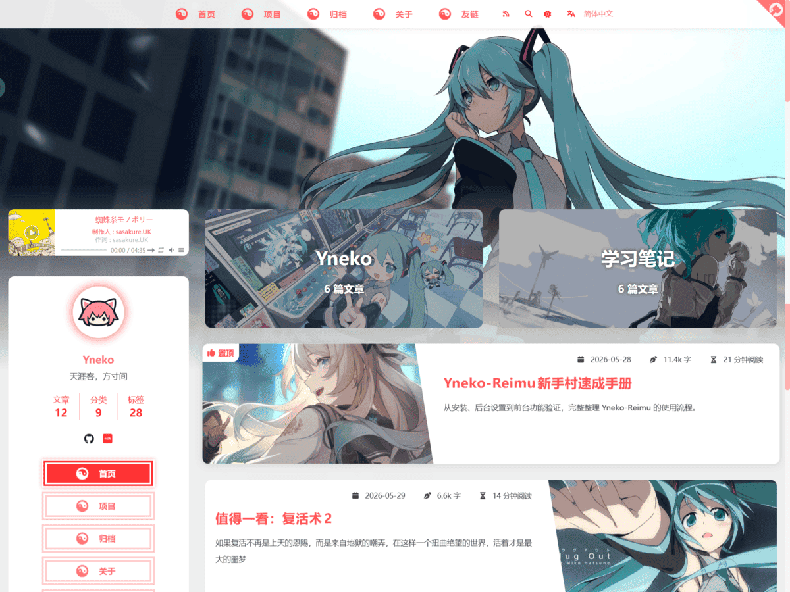

<p align="center">
  
</p>

<h1 align="center">Yneko-Reimu</h1>

<p align="center">
  一个面向 WordPress 的 Reimu 风格经典主题。
  <br>
  A WordPress Classic Hybrid port inspired by hexo-theme-reimu.
</p>

<p align="center">
  <a href="LICENSE"></a>
  <a href="https://github.com/EkaEva/Yneko-Reimu/releases"></a>
  <a href="https://github.com/EkaEva/Yneko-Reimu/actions/workflows/release-package.yml"></a>
  <a href="https://github.com/EkaEva/Yneko-Reimu/releases"></a>
  
  <a href="https://github.com/EkaEva/Yneko-Reimu/stargazers"></a>
</p>

<p align="center">
  <a href="#中文">中文</a> | <a href="#english">English</a>
</p>



## 中文

Yneko-Reimu 是一个受 [D-Sketon/hexo-theme-reimu](https://github.com/D-Sketon/hexo-theme-reimu) 启发的 WordPress Classic Hybrid 主题移植版，目标是在 WordPress 内容系统中重新实现并适配 Reimu 风格的视觉语言与交互体验。

本项目不是 hexo-theme-reimu 的官方 WordPress 版本，也不是原 Hexo 主题源码的直接延续。它以 WordPress 主题架构重新实现模板、Customizer、媒体库、后台设置、评论、登录、搜索、项目页和发布流程，同时保留 Reimu 风格的顶部导航、头图、文章卡片、侧栏作者卡、归档、友链、搜索弹窗、加载动画、暗色模式、音乐播放器、评论视觉、代码块样式和自定义鼠标指针等体验。

## 项目来源

Yneko-Reimu 的整体设计语言、页面结构、交互动效与部分前端样式参考并移植/适配自 [hexo-theme-reimu](https://github.com/D-Sketon/hexo-theme-reimu)。

- 原主题作者：D-Sketon
- 原主题仓库：[https://github.com/D-Sketon/hexo-theme-reimu](https://github.com/D-Sketon/hexo-theme-reimu)
- 原主题许可证：MIT License
- 原主题官网 / 演示站：[https://d-sketon.github.io/](https://d-sketon.github.io/)

Yneko-Reimu 在此基础上完成了 WordPress 侧的实现，包括 PHP 模板、WordPress 查询、评论系统、后台设置、媒体库配置、项目页 GitHub 拉取、PJAX/软导航适配、本地搜索索引、主题打包与发布清理等工作。

## 鼠标指针来源

主题当前内置的莉莉概念鼠标指针素材来源于 B 站作者「天羊EdSky」的相关设计，主题中将其整理为静态 PNG 光标状态并接入 WordPress 前台。

- 鼠标指针作者：天羊EdSky
- 作者主页：[https://space.bilibili.com/16573583](https://space.bilibili.com/16573583)
- 主题内用途：前台自定义 cursor，包括默认、链接、文本、加载、不可用、帮助、移动、拖拽与 resize 等状态

如果你要二次发布、商用或替换这些光标素材，请先确认素材原作者允许的使用范围。更完整的版权说明见 [NOTICE.md](NOTICE.md)。

## 功能概览

- Reimu 风格首页：顶部导航、头图、文章卡片、置顶文章、分类胶囊。
- Reimu 风格侧栏：作者头像、站点统计、31 种可开关社交入口、菜单按钮、标签云。
- 归档 / 关于 / 友链 / 项目虚拟页面：默认开启，未创建真实页面时自动提供主题页面；可在设置页关闭对应内置路径。
- GitHub 项目页：根据后台配置的 GitHub 主页拉取用户项目和 Star 项目。
- 文章分享：支持 8 种分享按钮，默认启用 QQ 和微信，并在微信分享时生成二维码卡片。
- 本地 JSON 搜索：支持生成 WordPress 本地搜索索引。
- PJAX / 软导航：减少站内切换时的整页刷新断档，并保持文章页目录/导航侧栏滚动状态。
- 音乐播放器：基于 APlayer，曲目、歌词和封面从 WordPress 媒体库配置。
- WordPress 原生评论视觉增强：支持 AJAX 无刷新提交、审核、回复、分页、登录弹窗和讨论串热度排序。
- 评论区图片 / GIF 上传：登录用户可上传，编辑器中以媒体占位符展示，最多保留 1 个图片或 GIF；开启审核后先进入临时目录，通过后才公开显示。
- 评论 GIF 表情库：管理员可上传公共 GIF，用户评论 GIF 经审核后也可加入表情库。
- 评论区账户面板：支持站内登录、邮箱验证码注册、邮箱验证码重置密码、GitHub 弹窗登录、登录后个人资料弹窗和评论区快捷退出。
- 评论用户体系：支持登录用户头像、个人资料、个人主页、两步验证、评论编辑/删除、角色特殊标签、自定义标签审核、审核状态提示和角色头像框。
- 内置中英双语系统：中文使用原地址，英文使用 `/en/` 前缀，文章/页面可互相关联翻译。
- GitHub OAuth 登录：主题内置登录模块，可在后台配置 Client ID / Secret。
- 自定义鼠标指针：桌面端使用莉莉概念光标 PNG，移动端自动回退。
- 代码块编辑器样式：三色圆点、文件类型标识、行号、复制、折叠。
- 暗色模式、阅读量、本地访客统计、回到顶部、加载动画、鼠标点击特效。
- 404 专属页：满屏背景、无底栏、不可滚动。

## 运行环境

- WordPress：建议 6.0 及以上
- PHP：8.0 及以上
- 浏览器：现代 Chromium / Firefox / Safari
- 主题类型：Classic Theme + PHP 模板 + theme.json
- 构建环境：Node.js，仅开发和打包时需要；线上使用 ZIP 不需要 Node

## 安装主题

### 方式一：后台上传 ZIP

1. 下载 Release 附件或本地打包得到 `releases/Yneko-Reimu-vX.Y.Z.zip`。
2. 进入 WordPress 后台。
3. 打开 `外观 -> 主题 -> 添加新主题 -> 上传主题`。
4. 上传 `releases/Yneko-Reimu-vX.Y.Z.zip`。
5. 安装并启用主题。

### 方式二：手动放入主题目录

1. 将仓库中的主题源码目录复制到 WordPress 的主题目录：

```text
theme/Yneko-Reimu -> wp-content/themes/Yneko-Reimu
```

2. 进入后台 `外观 -> 主题`。
3. 启用 `Yneko-Reimu`。

## 首次配置

主题启用后，建议先理解两个后台入口的分工：

- `外观 -> Yneko-Reimu 设置` 是主控制台，管理不依赖右侧实时预览的数据、服务和功能开关。
- `外观 -> 自定义 -> Yneko-Reimu 视觉预览` 是视觉预览工作台，只保留适合边看边调的图片、颜色、导航、侧栏和文章显示项。

这两个入口使用不同的数据存储：视觉/布局项继续使用 WordPress `theme_mod`，数据/服务/列表项使用 `yneko_reimu_settings`。旧版本已经保存的数据会继续读取，不需要手动迁移。

### 1. 外观 -> Yneko-Reimu 设置

这里保存的是站点数据型配置，内容会进入 WordPress 数据库，不会写入主题源码。设置页按标签页组织，底部提供悬浮保存按钮；后台界面语言跟随当前 WordPress 用户语言，中文环境显示中文，其它语言显示英文。

当前主控制台负责这些内容：

- 站点资料：站点头像、作者头像、游客评论头像、GitHub 展示链接、赞助二维码。
- SEO 与隐私提示：检测 Rank Math、Yoast、AIOSEO、SEOPress、The SEO Framework 后，主题会停用重复 meta / OG / Twitter / JSON-LD，仅保留 hreflang、sitemap 和 canonical 兼容补充。
- GitHub OAuth：Client ID、Client Secret、Callback URL、自动创建用户和管理员 GitHub 绑定。
- 多语言：启用状态、默认语言、英文路径前缀、语言菜单显示名、文章/页面翻译关系。
- 常规设置：内置项目、归档、关于、友链页面开关，默认全部开启。
- 评论设置：评论图片/GIF 上传、人工审核、大小上限、临时文件清理、驳回后清理时间、评论上传管理、公共 GIF 表情库。
- 用户设置：用户标签、自定义标签审核、屏蔽词、七种基础特殊标签、角色头像框、用户头像上传、头像审核、头像大小上限、用户标签和头像审核管理；有待审核项目时会显示数量角标。
- 搜索设置：Algolia、本地 JSON 搜索、本地全文索引开关。
- 友链设置：本站友链信息和友链列表。
- 主题扩展：加载动画、回到顶部、GitHub 三角标、PJAX、鼠标点击特效、统计、数学公式、PhotoSwipe、Mermaid、自定义鼠标指针。
- 第三方服务：Google Analytics、Cloudflare RUM、Giscus、Live2D、Vendor CDN base、隐私/本地资源优先说明。
- 曲目设置：APlayer、Meting、播放器行为、媒体库曲目。

#### 站点资料

- 站点头像：主题站点级图片兜底，用于部分 logo、登录页和分享图标 fallback。浏览器标签页和聊天软件小图标主要看 WordPress “站点图标”。
- 作者头像：用于前台侧栏作者卡、页面角色图、友链和项目缺省图。
- 游客评论头像：用于未登录用户评论时显示的默认头像。
- GitHub 主页链接：统一用于顶部 GitHub 三角标、侧栏 GitHub 链接和项目页拉取来源。
- 赞助二维码：留空则不显示赞助二维码；配置后可在页面底部或短代码中显示。

站点 Logo 和站点图标建议继续在 `外观 -> 自定义 -> 站点身份` 中设置，因为那里有 WordPress 原生预览。主题允许管理员上传 SVG 作为 Logo 或站点图标，但 SVG 可能携带脚本或外链，请只上传可信来源文件。如果想保留 SVG 站点图标，可在 `外观 -> Yneko-Reimu 设置 -> 常规设置` 额外配置 `Favicon / Apple Touch 兜底图`，推荐使用 `512x512` PNG/JPG；主题会保留 SVG favicon，并为不稳定支持 SVG 的浏览器、移动端和聊天软件输出 PNG/JPG fallback。`og:image` 仍建议使用 JPG 或 PNG，不建议使用 WebP，并继续由 Rank Math 等 SEO 插件管理。

#### 多语言设置

主题内置轻量中英多语言系统，不依赖 Polylang。

- 默认语言：建议保持 `zh_CN`。
- 英文路径前缀：默认 `en`，英文内容会使用 `/en/...`。
- 中文显示名 / 英文显示名：用于前台导航栏语言切换菜单。
- 访问中文页面时，语言菜单会指向对应英文内容；访问英文页面时，会指回对应中文内容。

文章和页面的中英对应关系在编辑器侧边栏的 `Reimu 设置` 中维护：

1. 先发布或保存中文文章 A，语言选择 `简体中文`。
2. 新建英文文章 B，语言选择 `English`，slug 建议使用英文。
3. 在 B 的 `对应翻译文章/页面` 中选择 A，保存。
4. 主题会自动把 A 和 B 的对应关系双向同步。
5. 中文文章继续使用原始链接，英文文章会显示为 `/en/your-slug/`。

主题会为中英文首页、文章和页面输出 `hreflang="zh-CN"`、`hreflang="en"` 和 `x-default`，并修正英文首页 canonical 与 Rank Math sitemap 中英文文章 URL 的一致性。没有设置语言的旧文章会被视为中文内容，避免启用多语言后旧内容从首页或归档消失。

#### GitHub 登录

主题内置 GitHub OAuth 登录，不需要额外安装独立插件。

1. 在 GitHub 创建 OAuth App。
2. 在 WordPress 后台复制主题显示的 Callback URL。
3. 将 Callback URL 填入 GitHub OAuth App 的 `Authorization callback URL`。
4. 回到 `外观 -> Yneko-Reimu 设置`，填写 Client ID、Client Secret、Callback URL 覆盖项和是否允许自动创建用户。
5. 保存后，评论登录弹窗中会出现 GitHub 登录入口。

Client Secret 只保存在 WordPress 数据库中，不应写入主题源码或提交到 GitHub。普通 GitHub 登录只用于登录或自动创建订阅者用户，不会绑定当前已登录的 WordPress 用户。管理员如需绑定或重新绑定 GitHub，请使用设置页中明确的“绑定/重新绑定 GitHub”入口。

评论区登录弹窗会显示站内账号登录表单和 GitHub 登录入口。站内登录使用邮箱和密码；当 WordPress 后台开启“任何人都可以注册”时，登录弹窗会额外显示注册入口。注册和忘记密码都使用邮箱验证码，验证码 5 分钟内有效。登录、找回密码和验证码发送使用统一错误文案与冷却策略，避免暴露账号是否存在。

登录成功后，评论区左侧显示用户头像和名称，头像右上角的小按钮和左侧身份栏底部的“退出”按钮都可无刷新退出登录；点击头像会打开站内“个人资料”弹窗。语言切换后，登录、注册、忘记密码和个人资料弹窗会跟随当前语言刷新文案。

#### 用户标签及头像框

用户设置标签页管理评论区站内用户相关能力。`用户标签及头像框` 区块提供：

- 用户标签总开关，默认开启。
- 用户标签审核，默认关闭。开启后，除管理员外的新自定义标签需要后台批准后才会显示。
- 评论区头像框总开关，默认关闭。
- 自定义标签屏蔽词，用 `/` 分隔。保存后，命中屏蔽词或系统保留词的旧自定义标签会自动停止显示。
- 用户标签审核列表，即使未开启审核，也会列出已存在的自定义标签，管理员可以单独撤销某个用户的某个标签。

特殊标签和头像框按七种基础身份统一管理：

```text
站长 > 管理员 > 编辑 > 作者 > 贡献者 > 会员 > 订阅者
```

每一行可配置该身份标签是否启用、中文显示名、英文显示名和头像框图片。头像框支持 PNG、WebP、AVIF；默认头像框为主题内置 `assets/images/avatar-frame.png`。用户同时拥有多个身份时，前台按上述优先级使用第一个可用头像框。

前台评论标签规则：

- 站长拥有全部特殊标签资格。
- 普通管理员显示管理员和会员资格。
- 编辑、作者、贡献者、订阅者只显示自己的最高角色标签和会员资格。
- 会员 / Yko 是所有登录用户都有的基础资格。
- 默认只启用最高优先级的一个特殊标签，用户可在个人资料弹窗里自行勾选或关闭。
- 特殊标签和自定义标签合计最多显示 2 个。
- 用户可设置自定义标签和颜色；系统保留标签、当前特殊标签显示名、屏蔽词都不能作为自定义标签。

用户个人资料弹窗中还提供“显示我的评论头像框”开关，默认开启。用户关闭后，只隐藏自己的头像框，不影响其标签和头像；保存后当前页面评论区会无刷新更新。

用户头像能力：

- 是否允许用户上传个人头像。
- 头像上传大小上限，默认 `1MB`。
- 头像审核开关，默认关闭。
- 用户头像管理区，可查看、批准、拒绝或删除用户上传头像。

前台个人资料弹窗支持修改头像链接或上传头像、昵称、邮箱、个人主页、密码和 TOTP 认证器两步验证。修改邮箱需要向新邮箱发送验证码；个人主页允许填写 `https://example.com`，也允许填写 `example.com` 这种纯域名，主题会自动规范化。GitHub 登录用户首次会默认使用 GitHub 主页作为个人主页；用户手动修改后优先使用手动值；清空并保存后，评论区名称不再跳转。两步验证默认关闭，用户可自行开启。

如果启用头像审核，用户上传并保存头像后会先进入待审核状态；审核通过后才会应用到前台，审核不通过会清理对应文件。

#### 评论上传

评论上传位于“评论设置”标签页，可配置：

- 图片上传开关，默认关闭。
- GIF 上传开关，默认关闭。
- 图片人工审核开关，默认关闭。
- GIF 人工审核开关，默认关闭。
- 图片大小上限，默认 `1MB`。
- GIF 大小上限，默认 `3MB`。
- 临时文件清理天数，默认 `7` 天。
- 驳回后文件清理时间，默认 `24` 小时。
- 管理员上传公共 GIF。
- 评论上传管理区。

未启用某一类上传时，评论区对应图片/GIF 上传按钮会直接隐藏。登录状态变化后，评论区上传按钮、文件选择框和提示会无刷新同步，避免退出登录后仍能打开本地文件选择器。

登录用户在评论区上传图片或 GIF 时，编辑器里只显示 `[IMAGE:1]` 或 `[GIF:1]` 这类占位符，不直接暴露真实存储 URL；预览和提交时主题会自动转换为对应媒体。字数统计会忽略图片、GIF 和媒体占位符。一条评论最多保留 1 个图片或 GIF，重复添加会询问是否清空当前媒体并替换，未提交就被替换的上传文件会自动清理。

启用人工审核后，文件会先保存到：

```text
wp-content/uploads/yneko-reimu-comments/tmp/
```

此时不会创建媒体附件记录，避免用户只上传不提交时污染数据库。管理员在评论上传管理区批准后，主题会把评论中实际引用到的临时文件转入正式目录：

```text
wp-content/uploads/yneko-reimu-comments/YYYY/MM/
```

正式文件会创建为隐藏附件，默认不显示在普通媒体库列表中。评论被删除、标记垃圾、审核撤销或未通过时，对应文件会按后台设置清理；超过后台设置天数未使用的临时上传也会通过 WP-Cron 自动清理。

评论上传管理区按三类展示：

- 后台上传的 GIF
- 用户评论 GIF
- 用户评论图片

后台 GIF 区提供两个入口：`上传本地 GIF 并入库` 会在选择文件后自动上传；`从媒体库加入 GIF` 会把已有媒体库 GIF 标记进评论 GIF 表情库。“仅移出表情库”只把 GIF 从前台 GIF 面板隐藏，不删除媒体附件；“删除文件”会删除 WordPress 附件和实际文件。用户评论图片/GIF 开启审核后，待审核文件只对站长、管理员、编辑和评论本人可见；后台可执行“通过”“驳回”“撤销”“删除”。评论图片只作为评论附件管理，不会进入 GIF 表情库。

评论区显示的图片和 GIF 最大为 `200x200`。如果后台删除了评论上传附件，纯图片或纯 GIF 评论会被直接删除；图文评论只移除对应媒体并保留文字，不再用缺失图片占位图表示后台删除。评论支持 Markdown 图片、链接、行内代码和代码块；代码块背景为深色，带语言名的围栏代码块也可正常解析。

为了减少刷屏，同一用户、邮箱或 IP 在一小时内不能重复发布完全相同的纯文字评论、单图片评论或单 GIF 评论。重复提交会返回明确提示，不再只显示“评论提交失败”。只有公共 GIF 库中的单个 GIF、且没有其它文字内容的评论会自动通过审核。

#### 搜索设置

搜索不依赖实时预览，因此统一在主设置页管理。优先级为：Algolia 配置完整时优先；否则使用本地 JSON；再否则回退 WordPress REST。

本地搜索默认使用 `/search.json`，英文页面自动使用 `/en/search.json`。搜索索引默认只输出标题、摘要、分类、标签和 URL；如确实需要前端全文搜索，可开启“索引全文内容”，但这会让全文一次性暴露在公开 JSON 中。

#### 友链列表

友链支持新增、编辑和删除，每条包含名称、链接、描述和头像。友链列表只在 `外观 -> Yneko-Reimu 设置` 中维护，不再出现在 Customizer。

友链设置开头提供独立的“本站友链信息”配置区，用于友链页“本站信息”代码块。可配置本站名称、链接、描述和 `image`。其中 `image` 仅接受 WebP 或 PNG；建议使用正方形 `512x512`，体积控制在 `200KB` 以内。

如果没有配置“本站友链信息 image”，主题会依次使用站点头像、作者头像和主题内置头像。主题默认提供三条来源相关示例友链：主题作者、hexo-theme-reimu 原作者、鼠标指针作者。用户可以自行删除或修改。

#### 主题扩展、第三方服务与隐私

主题扩展标签页管理不需要实时预览的功能开关。默认较轻：加载动画、回到顶部和 GitHub 三角标开启；PJAX、鼠标点击特效、统计、数学公式、PhotoSwipe、Mermaid、自定义鼠标指针、APlayer、Meting、Live2D 等默认关闭或按需启用。

第三方服务标签页集中展示 Google Analytics、Cloudflare RUM、Giscus、Live2D、Meting、jsDelivr/vendor CDN、mouse-firework 等可能连接第三方域名的功能。你可以关闭对应功能，或修改 Vendor CDN base。若站点重视隐私与可控性，建议优先使用本地资源和自托管脚本。

主题会做基础安全兜底：默认关闭 XML-RPC，移除 WordPress generator 版本号，拦截 `?author=数字` 作者枚举，尝试移除 `X-Powered-By`，并输出 `nosniff`、`SAMEORIGIN` 和严格来源策略等基础安全响应头。`readme.html`、`license.txt` 等 WordPress 根目录静态文件仍需在服务器、1Panel、Cloudflare 或 Nginx/OpenResty 规则中删除或拦截。

#### 音乐列表

音乐播放器默认不启用。请先将音频、歌词和封面上传到 WordPress 媒体库，再在设置页新增曲目。每首曲目包含歌名、作者、音频 URL、封面 URL、LRC 歌词 URL 和主题色。

APlayer 默认 `preload=metadata`，避免首屏直接拉取完整音频。启用播放器后会在首次进入页面时显示播放器；音频播放仍由浏览器策略和用户交互决定。未配置音乐且未配置 Meting 时，前台不会加载播放器。

### 2. 外观 -> 自定义 -> Yneko-Reimu 视觉预览

这里是视觉预览工作台，保存主题视觉和布局配置。它保留 WordPress Customizer 右侧实时预览的优势，适合调整需要“看效果”的项目。

常用配置包括：

- 站点身份：Logo、站点标题、副标题、站点图标。
- 预设：主题内置侧栏、顶部导航文字和链接、首页两个胶囊标题/链接/封面、播放器位置。
- 侧栏小组件：标签云、项目、近期文章、近期评论、归档、分类的开关、数量和排序。WordPress 原生小工具区默认不参与主题内置侧栏。
- 视觉主题：强调色、暗色模式默认值、侧栏位置、固定导航、导航滚动隐藏、太极装饰。
- 横幅与图片：默认横幅图片、默认卡片封面、默认头像/角色图、搜索弹窗背景图。
- 博客卡片：摘要字数、分类、标签、评论数、阅读时间。
- 文章页：TOC、更新时间、版权框、过期提示、上一篇/下一篇、代码块折叠高度。
- 分享与社交链接：上方管理 8 种文章分享按钮，默认只启用 QQ 和微信；下方管理 31 种侧栏社交图标，默认只启用 GitHub。
- 页脚文字。

默认横幅源码只保留一张 `assets/images/banner.webp`。如果用户在 Customizer 里设置“默认横幅图片”，会覆盖这张内置横幅；“默认卡片封面”和“搜索弹窗背景图”是独立配置，不会被一个全局背景图同时覆盖。

WordPress 原生“背景图片”不是主题默认横幅、默认封面或搜索背景的来源。要覆盖这些主题图片，请使用 `Yneko-Reimu 视觉预览 -> 横幅与图片` 中的对应项目。

## 推荐页面

主题内置几个 Reimu 风格虚拟页面。如果站点中不存在对应 slug 的真实页面，主题会自动显示虚拟页面。

| 路径 | 用途 |
| --- | --- |
| `/about/` | 关于页 |
| `/archives/` | 归档页 |
| `/friend/` | 友链页 |
| `/projects/` | GitHub 项目页 |

如果你创建了同名 WordPress 页面，主题会优先显示真实页面正文，并保留主题页面样式。项目页等真实页面是否显示评论区，取决于该页面编辑界面“讨论”里的“允许评论”是否勾选。

这些内置页面默认全部开启。可在 `外观 -> Yneko-Reimu 设置 -> 常规设置` 关闭项目、归档、关于或友链页面；关闭后，主题默认导航和菜单中的对应内置链接会被移除，对应内置路径返回 404。此开关不会影响 WordPress 原生分类、标签、日期等归档页。

## 本地搜索配置

主题提供本地搜索索引接口，默认地址为：

```text
/search.json
```

启用后，搜索弹窗会优先使用本地 JSON 搜索文章标题、摘要和正文。英文页面会自动读取：

```text
/en/search.json
```

搜索索引会按当前语言过滤文章。搜索提供方和本地 JSON 地址在 `外观 -> Yneko-Reimu 设置 -> 搜索设置` 中配置。

## 评论说明

评论功能默认使用 WordPress 原生评论系统。主题只是重写前台视觉，不替换数据库，也不强依赖第三方评论服务。

保留能力：

- 游客昵称 / 邮箱 / 网址
- 登录用户评论
- 评论审核
- 嵌套回复
- 评论分页
- 加载更多
- AJAX 无刷新发布评论
- GitHub 登录入口，可选
- 站内邮箱登录、验证码注册、验证码重置密码
- 登录用户个人资料弹窗
- 登录用户角色标签、自定义标签和头像框
- 登录用户图片 / GIF 上传
- 公共 GIF 表情库
- 评论上传临时文件清理
- 简单重复评论限制

主题不会伪装成 Waline，只是参考 Reimu 演示站中 Waline 评论组件的视觉形式做 WordPress 原生等效实现。

## 媒体与个人数据

为了方便发布到 GitHub，主题源码不应包含你的个人内容和敏感信息。

不建议提交到仓库的内容：

- GitHub OAuth Client Secret
- 数据库 SQL
- `.wpress` 备份
- 个人文章正文
- 个人音乐文件
- 歌词文件
- 赞助二维码
- 本地 WordPress 上传目录
- 本地备份目录

这些内容应该保存在 WordPress 数据库和媒体库中，通过后台配置引用。

## 开发与构建

安装依赖后可运行：

```bash
npm run check
npm run package
```

脚本说明：

- `npm run check:js`：检查前端 JS 和构建脚本语法。
- `npm run check:release-readiness`：检查所有运行时 PHP 文件的 `ABSPATH` 防直访保护、主题头部兼容字段、运行时 `readme.txt` 和 `1200x900` 发布截图。
- `npm run i18n`：提取 gettext 字符串，生成 `languages/yneko-reimu.pot`、`zh_CN.po/mo` 和 `en_US.po/mo`。
- `npm run build`：生成语言文件、光标 PNG，并通过 Vite 压缩输出 `assets/dist/`。
- `npm run check:assets`：检查运行时 PHP/CSS/JS 中没有 `data:image` 或 base64 图片载荷。
- `npm run lint:php`：通过 Composer 调用 PHPCS/WPCS 检查 PHP 代码。
- `npm run check`：依次执行 JS 检查、公开契约检查、发布就绪检查、构建和 PHP 规范检查。
- `npm run package`：先构建，再按白名单生成带版本号和时间戳的本地验证包，例如 `releases/Yneko-Reimu-vX.Y.Z-YYYYMMDD-HHMM.zip`。

如果需要生成带版本号的发布包，可以直接调用打包脚本：

```bash
pwsh tools/package-theme.ps1 -Version v0.2.2
```

生成结果：

```text
releases/Yneko-Reimu-vX.Y.Z-YYYYMMDD-HHMM.zip
```

构建产物位于：

```text
theme/Yneko-Reimu/assets/dist/
```

主要源码位置：

```text
theme/Yneko-Reimu/assets/src/reimu.js
theme/Yneko-Reimu/assets/src/reimu.css
theme/Yneko-Reimu/assets/src/yneko-reimu-base.css
theme/Yneko-Reimu/assets/src/yneko-reimu-adapter.css
theme/Yneko-Reimu/inc/
theme/Yneko-Reimu/template-parts/
```

打包脚本会从 `theme/Yneko-Reimu/` 按白名单复制主题运行文件，并排除开发源文件、构建工具、本地媒体和不应发布的个人内容。上传 WordPress 的是 `releases/` 目录中的主题 ZIP，例如 `releases/Yneko-Reimu-vX.Y.Z-YYYYMMDD-HHMM.zip`，不是 GitHub 仓库根目录的 ZIP。发布前请确认 `theme/Yneko-Reimu/screenshot.png` 已更新为 `1200x900` PNG。

图片和独立 SVG 图标应作为文件维护：主题图片放在 `theme/Yneko-Reimu/assets/images/`，独立图标放在 `theme/Yneko-Reimu/assets/images/icons/`，构建生成的小图片输出到 `assets/dist/`。小型 UI SVG 组件可以继续内联，但不要在 PHP/CSS/JS 中手写 `data:image` 或 base64 图片。

## GitHub Actions 自动打包

仓库内置了 `.github/workflows/release-package.yml`。当你向 GitHub 推送版本 tag 时会自动触发构建，例如：

```bash
git tag v0.2.2
git push origin v0.2.2
```

Action 会执行：

```bash
npm run check:js
npm run build
composer install --no-interaction --prefer-dist
composer run lint:php
pwsh tools/package-theme.ps1 -OutputName Yneko-Reimu-v0.2.2.zip
```

随后生成并上传：

```text
Yneko-Reimu-v0.2.2.zip
```

如果同名 GitHub Release 不存在，Action 会根据 tag 创建 Release；如果 Release 已存在，则会把 ZIP 上传到该 Release。也可以在 GitHub Actions 页面手动运行该 workflow，输入版本号后生成同名 artifact。

推荐 tag 命名使用 `vX.Y.Z`，例如 `v0.2.2`。如果手动输入 `0.2.2`，打包脚本会自动补成 `v0.2.2`。

## 开发文档

- [开发与构建](docs/development.md)
- [Hooks / Filters](docs/hooks.md)
- [发布流程](docs/release.md)
- [v0.2.2 发布说明](docs/release-notes-v0.2.2.md)
- [Theme Check 说明](docs/theme-check.md)

## 目录结构

```text
Yneko-Reimu/
├─ theme/
│  └─ Yneko-Reimu/
│     ├─ assets/
│     │  ├─ dist/           # 前台构建产物，进入发布 ZIP
│     │  ├─ images/         # 主题必要图片和光标
│     │  └─ src/            # 开发用前端源码，不进入发布 ZIP
│     ├─ inc/               # PHP 功能模块
│     ├─ languages/         # gettext 语言文件，进入发布 ZIP
│     ├─ template-parts/    # 模板片段
│     ├─ 404.php
│     ├─ index.php
│     ├─ single.php
│     ├─ page.php
│     ├─ style.css
│     └─ theme.json
├─ tools/                   # 仓库级构建和打包脚本
├─ docs/                    # 开发、Hooks、发布和 Theme Check 文档
├─ releases/                # 本地打包输出，默认不提交
├─ package.json             # 仓库根统一 npm 入口
├─ LICENSE
├─ NOTICE.md
└─ README.md
```

## 发布前检查

发布到 GitHub 前建议检查：

```bash
npm run check
npm run package
```

如果本地没有 Composer，可以先运行：

```bash
npm run check:js
npm run build
npm run package
```

CI 会在 GitHub Actions 中继续执行 PHPCS/WPCS。

同时确认仓库或 ZIP 中不包含：

- `wp-local/`
- `backups/`
- 数据库文件
- OAuth Secret
- 个人音乐
- 赞助二维码
- 未授权素材

## License

Yneko-Reimu 使用 MIT License 发布，详见 [LICENSE](LICENSE)。WordPress 本身基于 GPL 授权；如果你重新分发完整站点包或衍生发行包，请同时遵守 WordPress 生态和依赖库的许可证要求。

本主题包含对 [hexo-theme-reimu](https://github.com/D-Sketon/hexo-theme-reimu) 的参考、移植与 WordPress 适配。原主题由 D-Sketon 创作并以 MIT License 发布。

主题中包含的莉莉概念鼠标指针素材归原作者「天羊EdSky」所有。该素材的具体使用边界请以原作者发布说明为准。详细来源和版权声明见 [NOTICE.md](NOTICE.md)。

## 致谢

- [D-Sketon](https://github.com/D-Sketon)：感谢原作者创作 hexo-theme-reimu，并以开源方式分享如此完整而有辨识度的主题。
- [hexo-theme-reimu](https://github.com/D-Sketon/hexo-theme-reimu)：Yneko-Reimu 的主要设计与交互来源。
- [天羊EdSky](https://space.bilibili.com/16573583)：感谢莉莉概念鼠标指针素材的创作。

## English

Yneko-Reimu is a WordPress Classic Hybrid theme port inspired by [D-Sketon/hexo-theme-reimu](https://github.com/D-Sketon/hexo-theme-reimu), reimplementing and adapting the Reimu visual language and interaction patterns for WordPress.

This project is not the official WordPress version of hexo-theme-reimu, and it is not a direct continuation of the original Hexo theme source. It reimplements the theme for WordPress templates, the Customizer, the Media Library, a built-in settings page, comments, login, search, project pages, and release packaging while preserving the Reimu-style header, hero image, post cards, author sidebar, archives, friend links, search popup, loader, dark mode, music player, comment visuals, code blocks, and custom cursors.

### Origins

Yneko-Reimu's design language, page structure, interactions, and part of its front-end styling are ported and adapted from [hexo-theme-reimu](https://github.com/D-Sketon/hexo-theme-reimu).

- Original theme author: D-Sketon
- Original repository: [https://github.com/D-Sketon/hexo-theme-reimu](https://github.com/D-Sketon/hexo-theme-reimu)
- Original license: MIT License
- Original demo site: [https://d-sketon.github.io/](https://d-sketon.github.io/)

Yneko-Reimu adds the WordPress implementation layer: PHP templates, WordPress queries, native comments, theme settings, Media Library configuration, GitHub project fetching, PJAX adaptation, local search index generation, packaging, and release cleanup.

### Cursor Credits

The bundled Lily concept cursor assets are based on work by the Bilibili creator 天羊EdSky. They are organized into static PNG cursor states and wired into the WordPress front end.

- Cursor creator: 天羊EdSky
- Creator page: [https://space.bilibili.com/16573583](https://space.bilibili.com/16573583)
- Usage in this theme: default, link, text, loading, unavailable, help, move, drag, and resize cursor states

If you redistribute, commercialize, or replace these cursor assets, please confirm the original creator’s usage terms first. See [NOTICE.md](NOTICE.md) for credits and license notes.

### Features

- Reimu-style home page with navigation, hero image, post cards, sticky posts, and category capsules.
- Reimu-style sidebar with author avatar, site stats, 31 optional social links, menu buttons, and tag cloud.
- Virtual pages for About, Archives, Friend Links, and Projects when no real page with the same slug exists; they are enabled by default and can be disabled from the settings page.
- GitHub project page that fetches user repositories and starred repositories from the configured GitHub profile.
- Post sharing with 8 share services. QQ and WeChat are enabled by default, and WeChat sharing generates a QR-card popup.
- Local JSON search index for WordPress posts.
- PJAX-style soft navigation that keeps article TOC/navigation sidebar scrolling usable after in-site transitions.
- APlayer music player with audio, cover, and LRC lyrics configured from the WordPress Media Library.
- Enhanced WordPress native comment visuals with AJAX submission, moderation, replies, pagination, the login modal, and thread-level popularity sorting.
- Comment image/GIF uploads for logged-in users, shown as media tokens in the editor. A comment keeps at most one image or GIF; reviewed uploads stay temporary until approved.
- Comment GIF picker with administrator-uploaded GIFs and approved user-submitted GIFs.
- Comment account panel with site-account login, email-code registration, email-code password reset, GitHub popup login, a profile modal after login, and quick logout in the comment editor.
- Comment user system with profile avatars, profile URLs, 2FA, own-comment editing/deletion, role badges, custom-badge review, review status notices, and role-based avatar frames.
- Built-in Chinese/English multilingual system: Chinese uses normal URLs, English uses the `/en/` prefix, and posts/pages can be linked as translations.
- Built-in GitHub OAuth login configured from the WordPress admin.
- Custom Lily concept cursors on desktop with graceful mobile fallback.
- Code block styling with language labels, line numbers, copy, and collapse controls.
- Dark mode, view counts, local visitor stats, back-to-top, loading animation, mouse click effects, and a dedicated 404 page.

### Requirements

- WordPress 6.0 or later recommended
- PHP 8.0 or later
- Modern Chromium, Firefox, or Safari
- Classic Theme + PHP templates + theme.json
- Node.js only for development and packaging; the uploaded ZIP does not require Node.js

### Installation

#### Upload ZIP From WordPress Admin

1. Download a Release asset or build `releases/Yneko-Reimu-vX.Y.Z.zip` locally.
2. Open the WordPress admin.
3. Go to `Appearance -> Themes -> Add New -> Upload Theme`.
4. Upload `releases/Yneko-Reimu-vX.Y.Z.zip`.
5. Install and activate the theme.

#### Manual Installation

Copy the theme source directory into your WordPress themes directory:

```text
theme/Yneko-Reimu -> wp-content/themes/Yneko-Reimu
```

Then open `Appearance -> Themes` and activate `Yneko-Reimu`.

### First-Time Configuration

After activation, configure two admin areas with different responsibilities:

- `Appearance -> Yneko-Reimu Settings` is the main control panel for data, services, feature switches, and lists that do not need live preview.
- `Appearance -> Customize -> Yneko-Reimu Visual Preview` is the visual preview workbench for images, colors, navigation, sidebar layout, and post display options.

Visual/layout options continue to use WordPress `theme_mod`. Data, service, and list options use `yneko_reimu_settings`. Existing saved values remain readable; no manual migration is required.

#### Appearance -> Yneko-Reimu Settings

These settings are stored in the WordPress database and are not written into the theme source. The settings page uses tabbed sections with a floating save button. The admin UI follows the current WordPress user language: Chinese for Chinese locales and English for other locales.

The main control panel manages:

- Site profile: site avatar, author avatar, guest comment avatar, GitHub display URL, and sponsor QR code.
- SEO/privacy guidance: when Rank Math, Yoast, AIOSEO, SEOPress, or The SEO Framework is detected, the theme disables duplicate meta description, OG/Twitter tags, and JSON-LD, while keeping compatibility helpers for hreflang, sitemap URLs, and canonical output.
- GitHub OAuth: Client ID, Client Secret, Callback URL, auto-create users, and administrator GitHub binding.
- Multilingual settings: enabled state, default language, English URL prefix, language labels, and translation links.
- General settings: built-in Projects, Archives, About, and Friend Links page switches. All are enabled by default.
- Comments: image/GIF uploads, review toggles, size limits, temporary cleanup, rejected-file cleanup time, upload manager, and public GIF library.
- Users: user badges, custom-badge review, blocked labels, seven base special badges, role avatar frames, profile avatar uploads, avatar review, avatar size limit, badge management, and avatar manager. Pending review counts are shown as admin badges.
- Search: Algolia, local JSON search, and local full-content indexing.
- Friend links: Site friend-link info and friend list.
- Theme extensions: loader, back-to-top, GitHub ribbon, PJAX, click effects, stats, math, PhotoSwipe, Mermaid, and custom cursor.
- Third-party services: Google Analytics, Cloudflare RUM, Giscus, Live2D, vendor CDN base, and privacy/local-resource notes.
- Music: APlayer, Meting, player behavior, and Media Library tracks.

Site profile:

- Site avatar: site-level fallback image for parts of the theme such as logo-like displays, login screens, and sharing fallbacks. Browser tabs and many chat app link cards primarily use the WordPress Site Icon.
- Author avatar: front-end author card, character image, and friend/project fallback image.
- Guest comment avatar: default avatar for logged-out commenters.
- GitHub profile URL: shared by the GitHub corner ribbon, sidebar GitHub link, and project-page fetch source.
- Sponsor QR code: hidden when empty; shown in sponsor entries when configured.

Site Logo and Site Icon should usually be configured under `Appearance -> Customize -> Site Identity`, because WordPress provides native live preview there. The theme allows trusted administrators to upload SVG files for Logo and Site Icon, but SVG can contain scripts or external links, so upload only trusted files. If you want to keep an SVG Site Icon, configure `Favicon / Apple Touch fallback` under `Appearance -> Yneko-Reimu Settings -> General`; a square `512x512` PNG/JPG is recommended. The theme keeps the SVG favicon and outputs the PNG/JPG fallback for browsers, mobile clients, and chat previews that do not reliably support SVG. `og:image` should still use JPG or PNG and remains managed by SEO plugins such as Rank Math.

Multilingual settings:

- Default language: `zh_CN` is recommended.
- English URL prefix: default is `en`; English content uses `/en/...`.
- Chinese label / English label: shown in the front-end language switcher.
- The language menu links to the paired translation when one exists; otherwise it falls back to the target language home page.

Publishing translated posts and pages:

1. Create or save the Chinese post A and set its language to `简体中文`.
2. Create the English post B, set its language to `English`, and use an English slug.
3. In B's `Linked translation post/page` field, select A.
4. Save B. The theme syncs the relation in both directions.
5. Chinese content keeps the original permalink; English content is displayed under `/en/your-slug/`.

The theme outputs `hreflang="zh-CN"`, `hreflang="en"`, and `x-default` for paired home, post, and page URLs. It also fixes the English home canonical and keeps Rank Math sitemap URLs consistent with canonical English post URLs. Old posts without language metadata are treated as Chinese so existing content stays visible after enabling multilingual mode.

GitHub Login:

1. Create a GitHub OAuth App.
2. Copy the Callback URL shown by the theme in WordPress admin.
3. Paste it into the GitHub OAuth App `Authorization callback URL`.
4. Fill in Client ID, Client Secret, optional Callback URL override, and auto-create-user setting.
5. Save. The comment login modal will show the GitHub login entry when configured.

Client Secret is stored only in the WordPress database. Do not commit it to GitHub. Normal GitHub login only signs users in or creates subscriber accounts when enabled. It does not bind GitHub to the currently logged-in WordPress user. Administrators should use the explicit bind/rebind entry when they need to link their own GitHub account.

The comment login modal shows the site-account login form and the GitHub login entry. Site-account login uses email and password. When WordPress registration is enabled, the modal also shows a registration entry. Registration and password reset both use email verification codes, valid for 5 minutes. Login, reset, and code-send flows use generic error messages and cooldowns to avoid account enumeration.

After login, the comment editor shows the user avatar and name on the left. Both the small avatar-corner button and the bottom `Logout` button in the left identity column can log out without a full page reload. Clicking the avatar opens the profile modal. After language switching, the login, registration, lost-password, and profile modals refresh their labels without requiring a full page reload.

User badges and avatar frames:

The User settings tab manages site-account behavior in the comment area. The `User badges and avatar frames` block includes:

- User-badge master switch, on by default.
- Custom-badge review, off by default. When enabled, new custom badges from non-administrators require approval before they display.
- Comment avatar-frame master switch, off by default.
- Custom-badge blocklist separated with `/`. Existing custom badges matching blocked or reserved labels stop displaying automatically.
- User badge review list. Even when review is disabled, existing custom badges are listed and can be revoked per user.

Special badges and avatar frames are managed across seven base identities:

```text
Owner > Admin > Editor > Author > Contributor > Member > Subscriber
```

Each row can configure whether that identity badge is enabled, its Chinese label, its English label, and its avatar-frame image. Avatar frames support PNG, WebP, and AVIF. The default frame is the bundled `assets/images/avatar-frame.png`. When a user has multiple identities, the front end uses the first available frame in the priority order above.

Front-end badge rules:

- The site owner has all special badge qualifications.
- Other administrators have Admin and Member qualifications.
- Editors, authors, contributors, and subscribers only get their highest role badge plus Member.
- Member / Yko is the base qualification for every logged-in user.
- Only the highest-priority special badge is enabled by default; users can toggle their own special badges in the profile modal.
- Special badges and custom badges share a maximum display capacity of 2.
- Users can set custom badge labels and colors. System-reserved labels, current special badge labels, and blocked labels cannot be used as custom badges.

The profile modal also includes `Show my comment avatar frame`, enabled by default. Turning it off hides only that user's frame, without affecting badges or the avatar image itself; saving refreshes visible comments without a full page reload.

Profile avatar options:

- Allow or disallow user avatar uploads.
- Avatar upload size limit, default `1MB`.
- Avatar review toggle, off by default.
- Avatar manager for reviewing, approving, rejecting, or deleting uploaded user avatars.

The front-end profile modal lets users update avatar URL/uploaded avatar, nickname, email, personal website, password, and authenticator-app TOTP 2FA. Email changes require a verification code sent to the new address. Personal website accepts both full URLs like `https://example.com` and bare domains like `example.com`; the theme normalizes them automatically. GitHub-login users receive their GitHub profile URL as the initial website value; manual changes take priority, and clearing the field removes the comment-name link. Two-factor authentication is off by default and can be enabled by each user.

Comment uploads:

- Image uploads are off by default.
- GIF uploads are off by default.
- Image review is off by default.
- GIF review is off by default.
- Image limit defaults to `1MB`.
- GIF limit defaults to `3MB`.
- Temporary cleanup defaults to `7` days.
- Rejected-file cleanup defaults to `24` hours.
- Administrators can upload local GIFs or add existing GIFs from the Media Library.
- The upload manager groups items into admin GIFs, user comment GIFs, and user comment images.

When a type is disabled, its upload button is hidden from the comment editor. Login/logout state changes refresh upload buttons, file inputs, and status text without a full page reload.

When logged-in users upload images or GIFs in the comment editor, the editor shows tokens such as `[IMAGE:1]` or `[GIF:1]` instead of exposing the real storage URL. Preview and submission convert those tokens into the proper media output. The character counter ignores images, GIFs, and media tokens. Each comment keeps at most one image or GIF; adding another media item asks whether to clear and replace the current one, and replaced unsubmitted uploads are cleaned automatically.

When review is enabled, front-end uploads are first stored under:

```text
wp-content/uploads/yneko-reimu-comments/tmp/
```

No Media Library attachment is created at this point, so abandoned uploads do not immediately pollute the database. After administrator approval, files actually referenced by the comment are moved into:

```text
wp-content/uploads/yneko-reimu-comments/YYYY/MM/
```

Approved files are registered as hidden attachments. Files are cleaned when related comments are deleted, marked as spam, rejected, or revoked according to the configured cleanup windows. Unused temporary files older than the configured cleanup period are cleaned by WP-Cron.

The admin GIF area has two entry points: `Upload local GIFs` auto-submits after file selection, and `Add GIF from Media Library` marks an existing GIF as part of the comment GIF library. `Remove from library only` hides a GIF from the front-end picker without deleting the attachment. `Delete file` deletes the WordPress attachment and the actual file. When user comment image/GIF review is enabled, pending media is visible only to the site owner, administrators, editors, and the comment author. Administrators can pass, reject, revoke, or delete reviewed media. Comment images are managed as comment attachments and are not added to the GIF picker.

Comment images and GIFs are displayed within `200x200`. If a reviewed upload is deleted from the admin area, image-only or GIF-only comments are removed; mixed text/media comments keep the text and remove only the media. The front end no longer uses the missing-image placeholder for administrator-deleted media. Comments support Markdown images, links, inline code, and fenced code blocks; language-tagged fences are accepted and render with a dark code-block background.

To reduce spam, the same user, email, or IP cannot post the same text-only, image-only, or GIF-only comment more than once per hour. Duplicate submissions now return a clear JSON error instead of a generic front-end failure. A single GIF from the public GIF picker, with no extra text, is auto-approved.

Search settings:

Search is managed in the main settings page because it does not need live preview. Priority: Algolia when fully configured, then local JSON, then WordPress REST.

The default local search index is `/search.json`; English pages automatically use `/en/search.json`. The index includes title, excerpt, categories, tags, and URL by default. Full-content indexing can be enabled when needed, but it exposes post content in a public JSON file.

Friend links:

Friend links are managed only in `Appearance -> Yneko-Reimu Settings`, not in the Customizer. Each item has name, URL, description, and avatar.

The Friend Links settings tab includes a dedicated Site friend-link info section for the Site info code block on the friend-links page. It lets you configure the site name, URL, description, and `image`. The `image` field accepts WebP or PNG only; a square `512x512` image under `200KB` is recommended.

Theme extensions, third-party services, and privacy:

The Theme Extensions tab contains feature switches that do not need live preview. Defaults are light: loader, back-to-top, and GitHub ribbon are on; PJAX, click effects, stats, math, PhotoSwipe, Mermaid, custom cursor, APlayer, Meting, and Live2D are off or opt-in.

The Third-party Services tab explains features that may connect to external domains, including Google Analytics, Cloudflare RUM, Giscus, Live2D, Meting, jsDelivr/vendor CDN, and mouse-firework. You can disable the related features or replace the vendor CDN base. For privacy-sensitive sites, prefer local resources and self-hosted scripts.

Music playlist:

The music player is disabled by default. Upload audio, lyrics, and cover files to the WordPress Media Library, then add tracks in the settings page. Each track has title, artist, audio URL, cover URL, LRC lyrics URL, and theme color.

APlayer defaults to `preload=metadata` so the first page load does not pull full audio files immediately. When enabled, the player is visible on first page load; actual playback still follows browser autoplay and user-interaction policies. If no tracks or Meting config are present, the front-end music player is not loaded.

#### Appearance -> Customize -> Yneko-Reimu Visual Preview

This is the visual preview workbench. It keeps WordPress Customizer's right-side live preview for options that are easier to adjust visually.

Common options include:

- Site Identity: Logo, site title, tagline, and Site Icon.
- Preset: built-in sidebar, top navigation labels/URLs, two home capsules, and player position.
- Sidebar widgets: tag cloud, projects, recent posts, recent comments, archives, categories, limits, and ordering. WordPress native widgets are not used by the built-in sidebar by default.
- Visual Theme: accent color, default dark mode, sidebar position, sticky navigation, hide-on-scroll navigation, and Taichi decoration.
- Banner and Images: default banner, default card cover, default avatar/character image, and search popup background.
- Blog Cards: excerpt length, categories, tags, comment count, and reading time.
- Articles: TOC, updated date, copyright box, outdated notice, previous/next navigation, and code-block collapse height.
- Sharing and social links: the upper section manages 8 post share buttons, with only QQ and WeChat enabled by default; the lower section manages 31 sidebar social icons, with only GitHub enabled by default.
- Footer text.

The source theme now keeps only one bundled default banner: `assets/images/banner.webp`. If a user sets `Default banner image` in the Customizer, it overrides that bundled image. `Default card cover` and `Search popup background` are separate options and are not all overridden by one global background image.

WordPress's native Background Image is not the source for the theme's default banner, default cover, or search background. Use the corresponding options under `Yneko-Reimu Visual Preview -> Banner and Images` to replace them.

### Built-In Pages

If no real WordPress page with the same slug exists, the theme displays virtual Reimu-style pages:

| Path | Purpose |
| --- | --- |
| `/about/` | About page |
| `/archives/` | Archives |
| `/friend/` | Friend links |
| `/projects/` | GitHub projects |

If you create a real page with the same slug, WordPress page content is used first while keeping the theme styling. Whether a real page such as Projects shows the comment area depends on the page editor’s WordPress Discussion setting, `Allow comments`.

These built-in pages are all enabled by default. Under `Appearance -> Yneko-Reimu Settings -> General`, Projects, Archives, About, and Friend Links can be disabled individually. Disabled built-in pages are removed from the theme default navigation and matching built-in menu links, and their built-in paths return 404. This does not affect native WordPress category, tag, date, or other archive pages.

### Local Search

The default local search index is:

```text
/search.json
```

English pages automatically use:

```text
/en/search.json
```

The index is filtered by the current language. Search providers and custom local JSON URLs are configured under `Appearance -> Yneko-Reimu Settings -> Search settings`.

### Development And Packaging

Run these commands from the repository root:

```bash
npm run check
npm run package
```

Scripts:

- `npm run check:js`: checks front-end and tool JavaScript syntax.
- `npm run check:release-readiness`: checks `ABSPATH` direct-access guards, theme header compatibility fields, runtime `readme.txt`, and the `1200x900` release screenshot.
- `npm run i18n`: extracts gettext strings and generates `languages/yneko-reimu.pot`, `zh_CN.po/mo`, and `en_US.po/mo`.
- `npm run build`: generates language files, cursor PNGs, and minified Vite assets.
- `npm run check:assets`: checks runtime PHP/CSS/JS for forbidden `data:image` and base64 image payloads.
- `npm run lint:php`: runs PHPCS/WPCS through Composer.
- `npm run check`: runs JS checks, public contract checks, release-readiness checks, build, and PHP coding standards.
- `npm run package`: builds first, then creates a local validation ZIP with a version and timestamp, for example `releases/Yneko-Reimu-vX.Y.Z-YYYYMMDD-HHMM.zip`.

To build a versioned package:

```bash
pwsh tools/package-theme.ps1 -Version v0.2.2
```

Output:

```text
releases/Yneko-Reimu-vX.Y.Z-YYYYMMDD-HHMM.zip
```

Upload the ZIP in `releases/`, not the GitHub repository ZIP. Before a public release, replace `theme/Yneko-Reimu/screenshot.png` with a `1200x900` PNG.

Images and standalone SVG icons should be maintained as files: theme images in `theme/Yneko-Reimu/assets/images/`, standalone icons in `theme/Yneko-Reimu/assets/images/icons/`, and generated small images in `assets/dist/`. Small UI SVG components may stay inline, but do not hand-write `data:image` or base64 image payloads in PHP/CSS/JS.

### GitHub Actions Release Packaging

The workflow `.github/workflows/release-package.yml` runs when a version tag is pushed:

```bash
git tag v0.2.2
git push origin v0.2.2
```

It checks JavaScript, builds assets, runs PHPCS/WPCS, packages the theme, and uploads:

```text
Yneko-Reimu-v0.2.2.zip
```

If a GitHub Release for the tag does not exist, the workflow creates one. If it already exists, the ZIP is uploaded with overwrite enabled.

Current release notes: [v0.2.2](docs/release-notes-v0.2.2.md).

### Repository Layout

```text
Yneko-Reimu/
├─ theme/
│  └─ Yneko-Reimu/
│     ├─ assets/
│     │  ├─ dist/
│     │  ├─ images/
│     │  └─ src/
│     ├─ inc/
│     ├─ languages/
│     ├─ template-parts/
│     ├─ style.css
│     └─ theme.json
├─ tools/
├─ docs/
├─ releases/
├─ package.json
├─ LICENSE
├─ NOTICE.md
└─ README.md
```

### Personal Data And Security

Do not commit personal or sensitive content:

- GitHub OAuth Client Secret
- Database SQL files
- `.wpress` backups
- Personal post content
- Personal music files
- Lyrics files
- Sponsor QR codes
- Local WordPress uploads
- Local backup directories

These should live in the WordPress database and Media Library, referenced through theme settings.

The theme provides baseline hardening: XML-RPC is off by default, WordPress generator output is removed, numeric `?author=` enumeration is redirected, `X-Powered-By` is removed when PHP/server headers allow it, and fallback security headers such as `nosniff`, `SAMEORIGIN`, and a strict referrer policy are sent. Static WordPress root files such as `readme.html` and `license.txt` must still be removed or blocked at the server, 1Panel, Cloudflare, Nginx, or OpenResty layer.

### License

Yneko-Reimu is released under the MIT License. See [LICENSE](LICENSE). WordPress itself is GPL-licensed; redistributors should also follow WordPress ecosystem and dependency license requirements when packaging a complete site or derivative distribution.

This theme references [hexo-theme-reimu](https://github.com/D-Sketon/hexo-theme-reimu) and includes WordPress ports and adaptations inspired by it. The original theme was created by D-Sketon and released under the MIT License.

The bundled Lily concept cursor assets belong to their original creator, 天羊EdSky. Please follow the original creator’s usage terms. See [NOTICE.md](NOTICE.md) for detailed credits.

### Thanks

- [D-Sketon](https://github.com/D-Sketon), for creating and open-sourcing hexo-theme-reimu.
- [hexo-theme-reimu](https://github.com/D-Sketon/hexo-theme-reimu), the primary design and interaction source for Yneko-Reimu.
- [天羊EdSky](https://space.bilibili.com/16573583), for the Lily concept cursor artwork.
